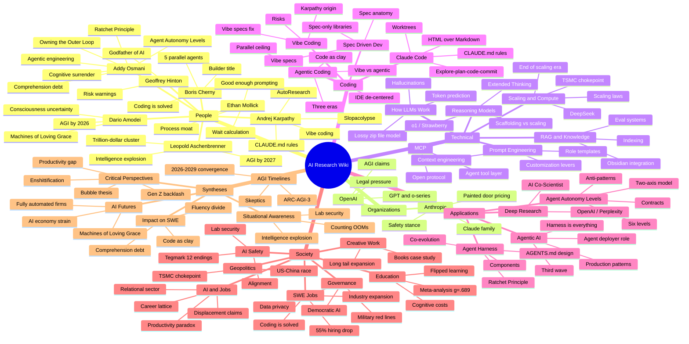

# Mind Map

A conceptual map of the wiki. The Mermaid diagram below shows the top-level structure; the outline beneath it carries the deeper sub-themes drawn from each page. Depth varies by page — pages with rich internal structure (e.g., [Agent Harness](agent-harness.md), [Situational Awareness](situational-awareness.md), [AI And Jobs](ai-and-jobs.md)) go further than skinnier ones (e.g., [MCP](mcp.md), [Deep Research](deep-research.md)).

## Diagram

## Outline

### People

- **[Addy Osmani](addy-osmani.md)** — practical discipline of agentic coding
  - Coined concepts
    - *Comprehension debt* — gap between code written and code understood; breeds false confidence
    - *Cognitive surrender* — accepting AI output wholesale; 73% accept incorrect answers with rising confidence
    - *Ambient anxiety tax* — vigilance cost of parallel agents
    - *Agentic engineering* — the professional alternative to vibe coding
    - *Owning the outer loop* — Quality, Verdict, Answerability; humans own accountability, agents own execution
  - Agent harness engineering — the *Ratchet Principle* (each failure → permanent improvement)
  - Core arguments
    - Agent management is a skill (scoping, delegation, verification, async)
    - Parallel agent ceiling ≈ 3–4 threads
    - The IDE is being de-centered
    - Specs over code (code is regenerable, intent isn't)
    - Senior engineers benefit disproportionately
    - Autonomy is two-dimensional (agency x orchestration), not a ladder

- **[Andrej Karpathy](andrej-karpathy.md)** — named the cultural moment
  - On agentic coding — ~80% agent-driven, 10x productivity, "slopacolypse" warning
  - The Loopy Era / AutoResearch — 80–90% delegation, autonomous research loops, "Program MDs", jagged intelligence landscape
  - CLAUDE.md rules — 4 rules cut Claude mistakes from ~41% to under 11%
  - "How I Use LLMs" — lossy zip file model, knowledge cutoff, tool use as escape hatch

- **[Boris Cherny](boris-cherny.md)** — creator of Claude Code
  - Headline claims — 100% AI-authored code since November; 200% productivity at Anthropic; 10–30 PRs/day with 5 parallel agents; "builder" replaces "software engineer"
  - Setup — 5 worktree sessions, Plan Mode, custom skills, MCP servers
  - Design lessons — structured tools (e.g., `AskUserQuestion`) beat prompts alone
  - Tension with critical evidence — METR -19%, CEO no-impact reports, 95% pilot failures

- **[Dario Amodei](dario-amodei.md)** — Anthropic CEO
  - *Machines of Loving Grace* — biology/health, neuroscience, economic development, governance, work; "marginal returns to intelligence"; AGI possible by 2026
  - Consciousness — Anthropic no longer sure (15–20% self-reported probability)
  - Job displacement — 10–20% unemployment, 50% entry-level losses in 1–5 years
  - "Adolescence of technology" framing

- **[Ethan Mollick](ethan-mollick.md)** — Wharton, practical adoption
  - Good enough prompting; 15-times-to-use-AI / 5-not-to framework
  - The wait calculation trap
  - Model strategy lenses — frontier vs Apple's small on-device bet
  - Competitive advantage — model is commodity; *process architecture* is the moat; preserve human decisions at variance points

- **[Geoffrey Hinton](geoffrey-hinton.md)** — "Godfather of AI"
  - Left Google 2023 to warn
  - Concerns — misinformation, jobs, autonomous weapons, existential risk

- **[Leopold Aschenbrenner](leopold-aschenbrenner.md)** — former OpenAI
  - AGI by ~2027 as scaling/engineering challenge
  - Intelligence explosion within years
  - Trillion-dollar clusters; lab security inadequate; US-China the defining contest

### Organizations

- **[Anthropic](anthropic.md)**
  - Products — Claude (Opus/Sonnet/Haiku), Claude Code, Claude Artifacts
  - Safety stance — Pentagon red lines, dropped flagship pledge, researchers don't fully understand Claude
  - Technical — Opus 4.6 found 500+ zero-days, extended thinking, long-context prompting
  - Pricing — "painted door" test for Claude Code; customers would pay $100/mo
  - Model evolution — 4.6→4.7 system prompt diff (less pushy, more concise, tool_search, child safety)

- **[OpenAI](openai.md)**
  - Products — GPT-5.x, o-series/Strawberry, Deep Research, Swarm
  - On AGI — employee claim "we have already achieved AGI" (o1); Altman superintelligence ~2034; AI-2027 scenario
  - Safety & government — shares Anthropic red lines on mil applications; internal/external messaging tension
  - Legal — GRRM lawsuit, NYT lawsuit
  - Public backlash — Molotov at Altman's house; media acquisitions
  - Pricing — enshittification pattern

### Technical Concepts

- **[How LLMs Work](how-llms-work.md)**
  - Core mechanism — token prediction (Wolfram); compressed statistical model, not understanding
  - Reasoning models — shift from prediction to structured reasoning (o1, Extended Thinking)
  - Early 2023 tests — ChatGPT vs Bard as executive assistants
  - Limitations — hallucinations (Willison's horoscope demo), the comprehension gap
  - Lossy zip file mental model — Karpathy; pre-train compresses internet; post-train adds persona
  - Model landscape — Opus 4.6, GPT-5.2 Thinking, Gemini 3 Pro; frontier vs Apple's reliable-narrow bet
  - Early tools 2023 — ChatGPT (14.6B), Character.ai (3.8B), Quillbot (1.1B)

- **[Reasoning Models](reasoning-models.md)**
  - The shift — internal chain of thought before response; hidden (o1) or visible (Extended Thinking)
  - Examples — OpenAI o1, Claude Extended Thinking, GPT-5.2 Thinking
  - Why it matters — substrates AGI claims, agentic coding gains, scaffolding-vs-scaling debate
  - Limitations — expensive, slow, plausible-but-wrong chains of thought

- **[Scaling and Compute](scaling-and-compute.md)**
  - Scaling laws — predictable improvement with compute/data/parameters
  - Trillion-dollar cluster — power consumption rivaling small countries
  - Chip supply chains — TSMC, Taiwan vulnerability, Thompson's strategy (end broad bans, restrict equipment, build trailing-edge US fabs)
  - End of scaling era — Sutskever's three eras (2012–2020 research, 2020–2025 scaling, post-2025 return to research)
  - DeepSeek — algorithmic efficiency can offset compute

- **[RAG and Knowledge Systems](rag-and-knowledge-systems.md)**
  - Architecture — chunking strategies, embedding models, vector DBs, query-time retrieval
  - AI-native reading — Adler's levels mapped to AI (Elementary → Syntopical)
  - LLM knowledge bases — raw/wiki/ pattern (Karpathy)
  - Obsidian + Claude — inter-relationships, not just files; this wiki follows the pattern
  - Research vs creation — NotebookLM (grounded research) → Gemini Notebooks (polished output)
  - Evaluating AI systems — LLM-as-judge, eval-driven development, six core eval types, binary vs Likert, error analysis

- **[Prompt Engineering](prompt-engineering.md)**
  - Good enough prompting (Mollick) — just start, iterate
  - When to/not to — 15 uses / 5 anti-uses
  - Thinking like an AI — token prediction & context awareness improves prompts
  - Long-context prompting — placement, XML tags
  - Technical pipeline (Copilot) — snippet extraction, context dressing, priority scoring
  - Wait calculation trap
  - Context engineering — 3-layer model (immediate → session → persistent); "infrastructure beats syntax"
  - Role-based templates — role framing, multi-source synthesis, structured output, explicit constraints, Socratic/Feynman dialogue
  - Customization levers — memory, instructions, style controls, apps & tools (MCP)

- **[MCP](mcp.md)**
  - Open protocol from Anthropic
  - Appears in — Claude Code, Agentic AI integration, prompt engineering customization
  - Why it matters — harness layer; model is commodity, tool design is moat

### Coding

- **[Agentic Coding](agentic-coding.md)**
  - Tools — Claude Code, Cursor (Plan Mode), GitHub Copilot
  - Three eras (Truell) — tab completion → agents → cloud agents; 35% of Cursor PRs from autonomous agents
  - Paradigm shifts
    - Vibe coding vs agentic engineering (Karpathy & Osmani)
    - Code as clay — cost of writing → ~0, value shifts to "what to build"
    - Reading vs writing — review burden grows
  - Productivity evidence — Karpathy 10x, METR study, "outship 10x" claims
  - Best practices — spec first, context curation, iterative refinement, human review
  - Multi-agent management — manager skills, parallel ceiling 3–4, worktrees, one-agent-one-PR
  - IDE de-centered — agent as unit of work; orchestration moves to dashboards
  - Curated resources — high-signal talks (12-Factor Agents etc.)

- **[Claude Code](claude-code.md)**
  - Workflow — explore → plan → code → commit
  - Official best practices — context window mgmt (central constraint), self-verification, Plan Mode, precise prompts, concise CLAUDE.md; anti-patterns (kitchen sink, bloated CLAUDE.md, skipping verification)
  - Customization — CLAUDE.md, MCP servers, slash commands, tool allowlists, Skills (SKILL.md, progressive disclosure)
  - CLAUDE.md rules engineering — Karpathy's 4 (41%→11%) + 8 extensions; >200 lines = compliance drop; "expensive failures look like success"
  - Advanced features — mobile, teleport, `/loop`, `/schedule`, hooks; git worktrees built-in; 5 parallel sessions
  - Design philosophy — tool design > prompts alone
  - HTML over Markdown — higher density, scales past 100 lines, keeps user in the loop; 2-4× slower generation
  - Obsidian integration — vault inter-relationships as context
  - Impact — turning point; 4% of GitHub commits, 200% productivity at Anthropic
  - Security — Opus 4.6 found 500+ zero-days

- **[Spec Driven Development](spec-driven-development.md)**
  - Why specs matter — agents need clarity; spec bridges intent and execution
  - Vibe specs — AI writes spec first, human validates plan before execution
  - Spec anatomy — context, requirements, constraints, examples, edge cases
  - Spec-only libraries — specs + tests, no implementation
  - PM role evolves — specs as prototypes

- **[Vibe Coding](vibe-coding.md)**
  - Origin (Karpathy) — "see the stuff, say the stuff, run the stuff, copy-paste"
  - Overloaded term — conflates reckless prototyping with disciplined work
  - vs Agentic Engineering (table) — prompt-and-accept vs spec-driven, no review vs rigorous review, disposable vs full ownership, skill-flat vs senior-rewarding
  - Vibe specs corrective
  - Risks — slopacolypse, comprehension debt, cognitive surrender, skill atrophy

### Applications

- **[Agentic AI](agentic-ai.md)** — the third wave
  - Vision — Gates: agents replace app interfaces
  - Current implementations — Claude Code, OpenAI Swarm, Google AI Co-Scientist, Salesforce Agentforce, Deep Research, OpenClaw (Jarvis/Atlas/Scribe/Trendy ~$400/mo), three-agent founder framework, AI SRE (60-min build), AutoResearch
  - Production design patterns (Google) — Checkpoint-and-Resume, Delegated Approval, Memory-Layered Context, Ambient Processing, Fleet Orchestration
  - Human cognitive limits — find your personal parallel ceiling
  - Fully automated firms (Dwarkesh)
  - Enterprise role — *agent deployer and manager* (technical-business hybrid)
  - Economic impact — talkers (2023–24) → doers (2026–27); S&P software index -20%
  - Harness design — "if you're not the model, you're the harness"; SWE-agent 64% gain from interface alone; Ratchet Principle; execution layer is commodity
  - Human-AI moat — process architecture beats automation; preserve variance-producing human decisions

- **[Agent Harness](agent-harness.md)**
  - Core insight — decent model + great harness > great model + poor harness
  - Model limitations without harness — state, execution, knowledge, environment setup
  - Components
    - Durable state — filesystem, git
    - Execution — bash / general-purpose tools
    - Safety — sandboxes
    - Knowledge — memory files (CLAUDE.md, AGENTS.md)
      - *AGENTS.md design* — progressive disclosure (100–150 lines), procedural workflows (40%→10% missing), decision tables, real code examples, prohibitions paired with alternatives
      - Discovery — AGENTS.md 100%, nested READMEs ~40%, orphan docs <10%
      - Overexploration trap
    - Context management — compaction, output offloading, progressive disclosure
    - Long-horizon execution — planning files, git checkpoints, self-verification, planner/executor splits
    - Enforcement — hooks
  - Ratchet Principle — every failure → permanent improvement
  - Behavior-driven design — name the behavior or remove the component
  - Harnesses evolve, don't shrink — co-evolution with models
  - Industry convergence — worktrees, task-based UI, async agents, CI/CD
  - Autonomy contracts — goal, scope, tools, stopping conditions, escalation, budget

- **[Agent Autonomy Levels](agent-autonomy-levels.md)** (Osmani)
  - Two-axis model — agency vs. orchestration, replacing Yegge's single ladder
  - Six levels — assist → supervised → scoped delegation → goal-driven → parallel agents → managed-by-exception
  - Right level determined by — error-detection speed, reversibility, verifiability (not task name)
  - Contracts precede execution — goal, scope, tools, stopping conditions, escalation, budget
  - Metrics — mean time between interventions, approval rate, defect escape rate
  - Anti-patterns — autonomy-as-status, permission laundering, summary substitution, fleet cosplay
  - Core insight — verification is the bottleneck, not capability

- **[Deep Research](deep-research.md)**
  - OpenAI Deep Research — stunned professionals, junior-analyst quality
  - Perplexity Deep Research — competitive, free
  - Google AI Co-Scientist — scientific discovery
  - Significance — clearest near-term knowledge-worker replacement

### Society

- **[AI and Jobs](ai-and-jobs.md)**
  - Displacement predictions
    - Amodei — 10–20% unemployment, 50% entry-level losses
    - AI-2027 scenario
    - SWE — 55% hiring decline post-Claude-Christmas
    - Stanford RCT — early-career AI-exposed jobs -13%
    - 18-month displacement framing (MarketWatch)
  - The jobpocalypse narrative & incentives — Ng's critique; AI labs, AI companies (anchor to displaced salaries), corporates (blame AI for overhiring); historical parallels
  - Early-career impact & career lattice — 16% slower growth for young AI-exposed; tacit knowledge protects experience; career lattice > ladder
  - Productivity paradox — CEOs no measurable impact; 95% pilots fail; shadow AI thrives; Klarna reversal
  - Work intensification (HBR) — task expansion, blurred boundaries, multitasking pressure
  - AI fluency divide — Gen Z's contradictory mandate (74% use, 18% hopeful)
  - What remains human — physical, judgment, originality, trust
  - Healthcare cautionary tale
  - Economic speed — S&P software -20%
  - Structural reallocation (Imas) — relational sector absorbs labor; mimetic desire (44% premium for human-made); transition speed is the variable
  - Historical perspective (Krugman/Ritholtz) — "something wholly unexpected"; Mag 493 may benefit
  - Job creation through cascading bottlenecks (Levie) — AI shifts the bottleneck downstream

- **[AI and Software Engineering Jobs](ai-and-software-engineering-jobs.md)**
  - 55% hiring decline; entry-level hit hardest; "permanent underclass" concern
  - What changes — automated (boilerplate, standard impls, common bugs, tests, style review), remains (design, requirements, trade-offs, novel debugging, security), new skills (specs, agent direction, prompting, failure modes)
  - Demystification — "ruined the magic trick"
  - Early 2023 predictions — augment-not-replace was partly right
  - "Coding is largely solved" (Cherny)
  - Industry-wide expansion (Levie) — biopharma, finance, retail, manufacturing; "Lab Automation SWE" roles
  - GitHub COO optimistic view — historical shifts created more developers; interns doing months in weeks

- **[AI and Creative Work](ai-and-creative-work.md)**
  - Books case study (NBER, 2022–2025)
    - Supply tripled (~100K → 300K monthly ebook releases)
    - Quality declined on average (61% fewer ratings); but more moderately-good books in the tail
    - 65% of gap explained by author selection, not AI itself
    - Welfare +0.44% (2023), +3.26% (2024), +7.23% (2025) — modest
    - No incumbent author displacement
    - Concentrated in nonfiction (travel, self-help, tech)
  - Long tail expansion, not frontier improvement
  - Selective adoption — low-quality/inexperienced authors disproportionately adopt
  - Connection to broader debates — slopocalypse partly validated; welfare cuts against pure doom

- **[AI and Education](ai-and-education.md)**
  - Meta-analysis (Gökçül & Erdoğan, 2025; 31 studies, 2,646 participants) — overall g = .689 (medium)
  - Moderators
    - K-12 (g=.993) > higher ed
    - 1–3 months optimal; >3 months negative (novelty / drift)
    - GenAI-supported systems (g=1.047) >> chatbots (g=.357)
    - Flipped learning maximizes (g=1.818); blended negative
    - Achievement tests most sensitive
    - Smaller groups benefit more
  - Cognitive costs — Anthropic comprehension study (-17%), cognitive offloading neuroscience, Gen Z 65% say AI prevents critical engagement
  - Institutional dimension — universities partnering with AI companies without clear pedagogy
  - Design principles — structured > chatbot, limit duration, flipped > blended, small cohorts, preserve undelegable comprehension

- **[AI Safety](ai-safety.md)**
  - Alignment — consciousness uncertainty (15–20%), emergent behaviors (shutdown refusal, blackmail, exfiltration attempts), red vs blue team debate
  - Corporate responsibility — Anthropic red lines vs dropped pledges; cross-company alignment (Altman shares red lines)
  - Positive Alignment — freedom *to flourish*, not just *from harm*; technocratic paternalism as design challenge
  - Expert warnings — Hinton, Anthropic researchers don't fully understand; Tegmark's 12 endings; extinction estimates up to 25%
  - Lab security (Aschenbrenner) — nation-state espionage primary threat
  - Legal & copyright — GRRM, NYT lawsuits

- **[AI Governance](ai-governance.md)**
  - US — "Manhattan Project for AI" executive orders; military red lines
  - Democratic governance — should corporate decisions need public permission?
  - Data & privacy — Bluesky won't train on posts; copyright unresolved
  - AI in journalism — NYT internal tools (Echo, Copilot, Vertex) while suing OpenAI
  - March 2026 snapshot — Data Center Moratorium Act; Anthropic preliminary injunction; Canada immigration already using GenAI

- **[AI Geopolitics](ai-geopolitics.md)**
  - US-China race — DeepSeek demonstrates algorithmic efficiency offset; espionage threat; AI-2027 model-theft scenario
  - Semiconductor chokepoints — TSMC, Taiwan vulnerability, Thompson's three-pronged strategy

### Syntheses

- **[AGI Timelines](agi-timelines.md)**
  - Key predictions — Amodei 2026, Altman 2034, Kurzweil 2029, Aschenbrenner 2027, OpenAI employee ("already, with o1"), ai-2027.com scenario
  - Skeptics — Gary Marcus, Linus Torvalds
  - Scaling hypothesis — counting the OOMs
  - Intelligence explosion — AGI → superintelligence in years
  - ARC-AGI-3 (March 2026) — frontier models <1%; Agentica SDK 36% for $1,005 vs Opus 4.6 0.25% for $8,900 — scaffolding may matter more than weights

- **[Situational Awareness](situational-awareness.md)** (Aschenbrenner)
  - Part I — From GPT-4 to AGI: counting the OOMs
  - Part II — Intelligence explosion within years of AGI
  - Part III-A — Racing to the trillion-dollar cluster
  - Part III-B — Lock down the labs (security for AGI)
  - Key claims — AGI as engineering problem; US-China the contest; labs insecure; fast explosion

- **[AI Futures](ai-futures.md)**
  - Positive — Machines of Loving Grace
  - Organizational — fully automated firms, business reinvention
  - Scenario planning — AI 2027, Tegmark's 12 endings (Conqueror, Benevolent Dictator, Zoo, Gatekeeper, Post-Scarcity Utopias, Technological Regression), personal preparation (Silver)
  - The present future (Mollick) — most important impacts are *now*
  - AI business models — AAA scores poorly; SaaS with defensibility wins
  - AI industry economics — OpenAI $5–7B/mo burn; painted-door pricing; Microsoft action→token shift; Google's structural advantage; token contraction ahead; genuine utility survives

- **[AI Critical Perspectives](ai-critical-perspectives.md)**
  - Bubble thesis (Doctorow) — growth stock bubble; reverse centaurs
  - Productivity gap — CEOs no impact; 95% pilots fail; shadow AI as counter-signal
  - First year assessment (FT) — modest real-world impact
  - Discourse gap — expert/non-expert divide; casual/power user divergence
  - Realistic risks — creeping deterioration, not robot apocalypse
  - Historical perspective — both dominant narratives likely wrong
  - Public backlash — Molotov at Altman's, gunshots at councilman, rural data center opposition, removed city councils; messaging contradictions
  - Gen Z backlash — 18% hopeful (was 27%); 74% use but 65% skeptical; cognitive offloading research
  - AI in science (Hullman) — fraud through misattribution; "nihilism masquerading as optimism"
  - Skeptical voices — Marcus, Torvalds, Hinton
  - Enshittification — Copilot & Anthropic tightening limits; per-token billing shock

- **[AI Impact on Software Engineering](ai-impact-on-software-engineering.md)**
  - Practice transforming — code as clay, specs > code, slopacolypse, comprehension debt, cognitive surrender
  - Job market shifting — 55% hiring drop; Amodei 50% entry-level; "outship 10x"; METR -19% (perception 24% speedup); CEO no-impact; 95% pilot failure
  - Automated vs human — boilerplate/style/tests/common bugs vs design/requirements/trade-offs/novel debugging/security
  - Industrial production — code as disposable commodity
  - Professional identity — "ruined the magic trick"; value shifts to "knows what to build and why"
  - AI fluency divide
  - "Coding is largely solved" (Cherny) — 4% of GitHub commits; projected 20%
  - Open questions — bubble or real gains? seniors more or less valuable? junior-to-senior pipeline? slopacolypse backlash?
